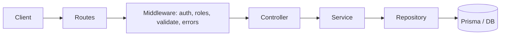

# Сервис пользователей (Node.js)

REST API: регистрация, вход по JWT, профиль, список пользователей (admin), блокировка.

**Стек:** Express 5, TypeScript, Prisma, JWT, bcrypt, Zod, pino.

## Быстрый старт

```bash
cp .env.example .env
npm install
npm run db:push
npm run db:seed
npm run dev
```

API: `http://localhost:3000`  
По умолчанию SQLite (`dev.db`). Учётка admin — после `db:seed`, логин и пароль в `.env.example`.

Проверить, что всё собирается:

```bash
npm test
npm run openapi:validate
```

## API-контракт

Спецификация: [docs/openapi.yaml](docs/openapi.yaml).  
Открыть в [Swagger Editor](https://editor.swagger.io/) (Import file) или импортировать в Postman / Insomnia.

Ошибки всегда в одном формате:

```json
{
  "error": {
    "code": "VALIDATION_ERROR",
    "message": "password must be at least 8 characters",
    "details": {
      "fields": [{ "field": "password", "code": "too_small", "message": "..." }],
      "fieldErrors": { "password": ["..."] },
      "formErrors": []
    }
  }
}
```

Методы, коды ответов и примеры — в OpenAPI. Заголовок авторизации: `Authorization: Bearer <accessToken>`.

### Логин

При неверном email, пароле или заблокированном аккаунте — всегда `401` и текст `Invalid email or password` (без уточнения, что именно не так).

## PostgreSQL (опционально)

```bash
docker compose up -d
cp .env.postgres.example .env
```

В `prisma/schema.prisma` для `datasource db` указать `provider = "postgresql"`, затем `npm run db:push`, `npm run db:seed`, `npm run dev`.  
Остановка: `docker compose down` (данные в volume `users_pg_data`).

## Структура

```
docs/openapi.yaml   # контракт API
src/modules/users/  # routes → controller → service → repository
prisma/             # схема, seed
tests/              # vitest + supertest
```



## Модель пользователя

| Поле | Описание |
|------|----------|
| `fullName` | ФИО |
| `birthDate` | `YYYY-MM-DD`, не в будущем, возраст 14–150 лет |
| `email` | Уникальный |
| `password` | bcrypt-хеш, в ответах не отдаётся |
| `role` | `admin` \| `user` (при регистрации — `user`) |
| `status` | `active` \| `inactive` |

## Скрипты

| Команда | Назначение |
|---------|------------|
| `npm run dev` | Запуск с hot-reload |
| `npm run build` / `npm start` | Production-сборка |
| `npm test` | Интеграционные и контрактные тесты |
| `npm run db:push` | Применить схему БД |
| `npm run db:seed` | Создать admin |
| `npm run openapi:validate` | Проверить `docs/openapi.yaml` |
| `npm run env:jwt-secret` | Сгенерировать случайный `JWT_SECRET` (вставить в `.env`) |

## Тесты

```bash
npm test
```

`users.api.test.ts` — интеграция, `contract.api.test.ts` — сверка с OpenAPI, `openapi.spec.test.ts` — что в yaml есть нужные коды ответов.

## Конфигурация (.env)

| Переменная | Назначение |
|------------|------------|
| `BCRYPT_ROUNDS` | Сложность bcrypt (10–15, по умолчанию 12) |
| `JWT_SECRET` | Подпись access token |
| `DATABASE_URL` | SQLite или PostgreSQL |
